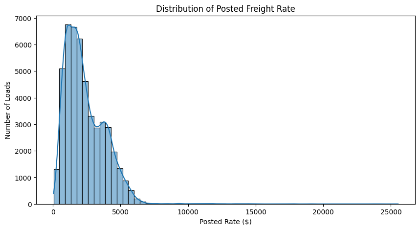
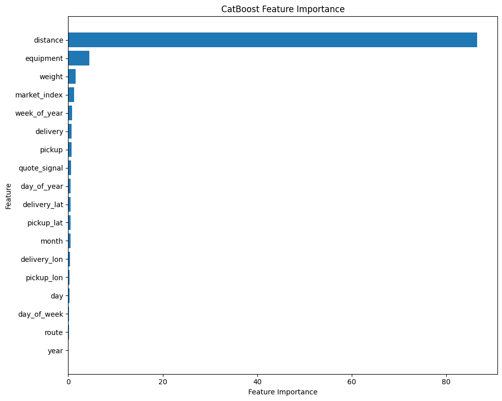
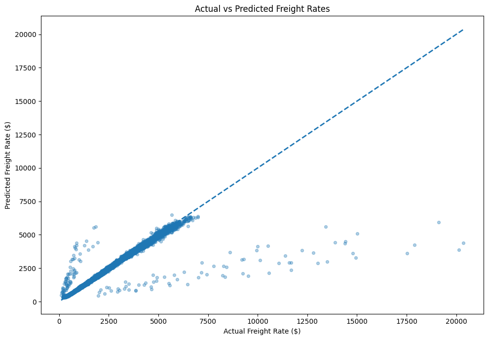
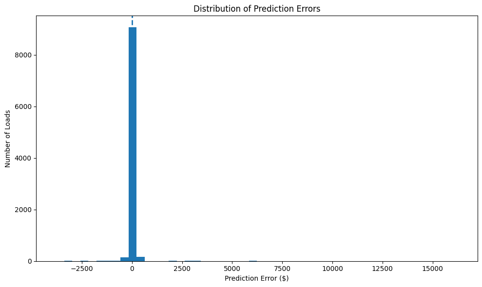
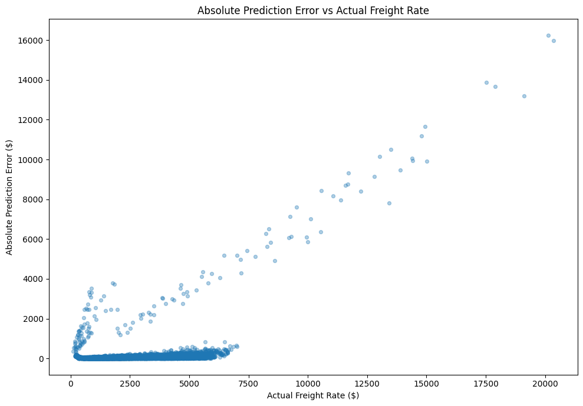
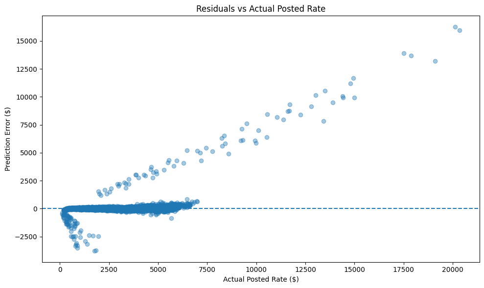
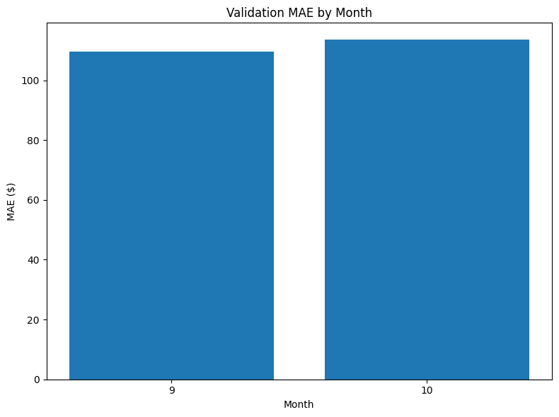
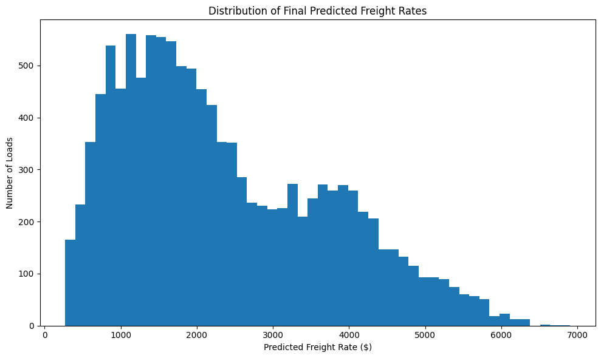

<h1 align="center">Freight Rate Prediction</h1>

<p align="center">
  Predicting the posted rate of freight loads with gradient-boosted trees and a time-aware validation strategy.
</p>

<p align="center">
  
  
  
  
</p>

> Solution to the Spotter **Machine Learning Engineer** assessment. Given 48,000 labeled loads (Jan–Oct 2025), the goal is to predict `posted_rate` for 12,000 unseen loads (Nov–Dec 2025).

---

## Table of Contents

1. [Results at a Glance](#results-at-a-glance)
2. [Repository Structure](#repository-structure)
3. [Getting Started](#getting-started)
4. [Data](#data)
5. [Data-Quality Findings](#data-quality-findings)
6. [Validation Strategy](#validation-strategy)
7. [Modelling](#modelling)
8. [Results](#results)
9. [Final Predictions](#final-predictions)
10. [Limitations and Next Steps](#limitations-and-next-steps)

---

## Results at a Glance

| Metric (Sep–Oct 2025 holdout) | Value |
| :--- | ---: |
| Mean absolute error (MAE) | **$111.62** |
| Root mean squared error (RMSE) | $632.73 |
| R² | 0.828 |
| Mean absolute percentage error | 5.41% |
| Median absolute error | $38.90 |

**Key takeaways**

- **Distance drives price.** It has a 0.91 correlation with the rate and about 86.5% of the model's feature importance.
- **No rows were discarded.** Negative and missing weights were converted to missing values and imputed with training-period medians.
- **The split is chronological**, matching how the model is used: train on the past, predict the future.
- **Simpler won.** A log-transformed target and five engineered features both scored slightly worse than the plain 18-feature model.
- **One weakness is clear.** 24 extreme loads (≥ $10,000) are under-predicted by ~73% on average and account for most of the squared error.

---

## Repository Structure

> Adjust the names below to match your repository.

```text
.
├── README.md
├── requirements.txt
├── freight_rate_ml_assessment.ipynb   # full analysis, training and prediction pipeline
├── validation_predictions.csv         # final output: load_id, predicted_rate (12,000 rows)
├── report/
│   └── Freight_Rate_Prediction_Report.pdf
├── data/                              # input files (not tracked)
│   ├── train_test.csv
│   ├── validation.csv
│   ├── validation_predictions_template.csv
│   └── december-chart-inputs.csv
└── images/                            # figures used in this README
```

---

## Getting Started

### 1. Clone and install

```bash
git clone <your-repository-url>
cd <your-repository-folder>

python -m venv .venv
source .venv/bin/activate          # Windows: .venv\Scripts\activate
pip install -r requirements.txt
```

### 2. Add the data

Place the provided CSV files in the `data/` folder.

### 3. Run the pipeline

```bash
jupyter notebook freight_rate_ml_assessment.ipynb
```

Run all cells from top to bottom. The notebook cleans the data, builds features, trains the model on the chronological split, evaluates it and writes `validation_predictions.csv`.

> **Note on file paths.** The notebook was developed in Google Colab and reads files from `/content/` (for example `/content/train-test.csv`). When running locally, update the paths in the first data-loading cell to point to your `data/` folder.

---

## Data

| File | Rows | Date range | Role |
| :--- | ---: | :--- | :--- |
| `train_test.csv` | 48,000 | 2025-01-01 to 2025-10-31 | Labeled development data |
| `validation.csv` | 12,000 | 2025-11-01 to 2025-12-31 | Loads that need final predictions |
| `december-chart-inputs.csv` | 31 | 2025-12-01 to 2025-12-31 | Fixed scenarios for the December chart |

Each load contains pickup and delivery city (64 locations) with coordinates, `distance`, `equipment` (Dry Van, Reefer, Flatbed), `weight`, `date`, `market_index` and `quote_signal`. The target `posted_rate` averages $2,374 (median $2,031) and is right-skewed.

<p align="center">
  
  <br><em>Distribution of the posted freight rate in the development data.</em>
</p>

---

## Data-Quality Findings

| Issue | Training | Validation | Treatment |
| :--- | ---: | ---: | :--- |
| Negative `weight` | 292 | 145 | Set to missing |
| Missing `weight` | 300 | 165 | Median imputation |
| Missing `market_index` | 374 | 249 | Median imputation |
| Duplicate rows / load IDs | 0 | 0 | None needed |

Rows with invalid weights have average rates, distances and equipment mix very close to clean rows, so deleting them would have discarded valid information without removing any bias. Predictions are also required for every validation load, so all rows were kept. Imputation medians were computed on the **training period only** and then reused unchanged, which prevents information from the holdout leaking into training.

---

## Validation Strategy

The final predictions cover November–December, entirely after the development data. A random split would mix neighbouring days across training and evaluation and overstate performance, so the data was split by date:

| Set | Period | Rows |
| :--- | :--- | ---: |
| Model training | 2025-01-01 to 2025-08-31 | 38,477 |
| Holdout validation | 2025-09-01 to 2025-10-31 | 9,523 |

A first attempt cut at the 80% row position, which landed in the middle of a day and put the same date in both sets. It was replaced with a strict calendar cut at **2025-09-01**, and a check confirmed zero date overlap.

---

## Modelling

**Model:** `CatBoostRegressor`, chosen because it handles high-cardinality categorical features (cities, routes) natively, captures non-linear effects, and needs little tuning.

| Setting | Value |
| :--- | :--- |
| Loss / metric | RMSE |
| Iterations / learning rate / depth | 1000 (max) / 0.05 / 8 |
| Early stopping | 100 rounds, best iteration 154 |
| Seed | 42 |

**Features (18):** pickup, delivery, equipment, route (`pickup -> delivery`), pickup/delivery latitude and longitude, distance, weight, market_index, quote_signal, and six calendar features (year, month, day, day of week, day of year, week of year).

**Candidates compared**

| Model | MAE ($) | RMSE ($) | R² | Selected |
| :--- | ---: | ---: | ---: | :---: |
| CatBoost, 18 original features | **111.62** | **632.73** | **0.8281** | ✅ |
| CatBoost, log-transformed target | 114.52 | 635.84 | 0.8264 | |
| CatBoost, 23 features (engineered) | 119.18 | 633.45 | 0.8277 | |

---

## Results

### Feature importance

<p align="center">
  
  <br><em>Distance dominates; equipment, weight and market_index follow far behind.</em>
</p>

### Predicted vs. actual

<p align="center">
  
  <br><em>Most loads sit on the diagonal. The off-diagonal points are mostly the extreme-rate loads.</em>
</p>

### Error analysis

<p align="center">
  
  <br><em>Errors are tightly centred on zero, with a thin tail.</em>
</p>

<p align="center">
  
  <br><em>Error stays low for ordinary loads and grows for the rare very expensive ones.</em>
</p>

<p align="center">
  
  <br><em>Residuals versus actual rate.</em>
</p>

**Error by rate band**

| Actual rate | Loads | Mean abs. error ($) | Median abs. error ($) |
| :--- | ---: | ---: | ---: |
| $0–1K | 1,545 | 81.45 | 23.80 |
| $1K–2K | 3,077 | 45.62 | 30.49 |
| $2K–3K | 2,077 | 56.41 | 42.67 |
| $3K–5K | 2,316 | 100.93 | 64.00 |
| $5K–10K | 484 | 412.96 | 141.58 |
| $10K+ | 24 | 10,246.07 | 9,704.78 |

### Stability over time

<p align="center">
  
  <br><em>MAE is stable across the two holdout months ($109.61 in September, $113.55 in October).</em>
</p>

<!--
### December prediction chart
Add the chart produced by the provided score.py here:
<p align="center"></p>
-->

---

## Final Predictions

The selected model was applied to all 12,000 loads in `validation.csv` using the same cleaning and features. The output file `validation_predictions.csv` has exactly two columns, `load_id` and `predicted_rate`.

| Check | Result |
| :--- | :--- |
| Rows | 12,000 |
| Missing predictions / duplicate IDs | 0 / 0 |
| Range | $300.75 – $6,613.06 |
| Mean / median | $2,358.36 / $2,041.51 |

<p align="center">
  
  <br><em>The predicted distribution mirrors the shape of the training target.</em>
</p>

---

## Limitations and Next Steps

- **Refit on all labeled data.** The submitted model was trained on Jan–Aug only; refitting on all 48,000 rows with ~155 iterations would add the months closest to the forecast window.
- **Stricter validation.** The holdout also guided early stopping and model selection, so its scores are slightly optimistic. Rolling-origin cross-validation would give a more reliable estimate.
- **Extreme-rate loads.** Understand what drives the rare $10,000+ postings; if they are real, find a feature that explains them, and if they are errors, test a robust loss such as Huber.
- **Prediction intervals.** Quantile models would flag when a quote is unreliable.
- **Hyperparameter tuning.** Depth, learning rate and regularisation were not searched.
- **Extrapolation.** Tree models cannot extrapolate beyond the training range, so Nov–Dec errors should be monitored as actuals arrive.

---

<p align="center"><sub>Built for the Spotter Machine Learning Engineer assessment · Naema Abdikani Ibrahim</sub></p>
